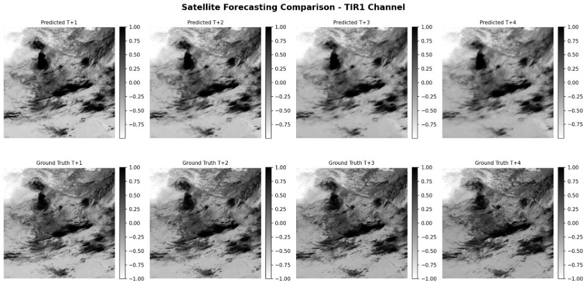

# CloudChase: Cloud Motion Prediction using INSAT-3DR/3DS Imagery



## Performance Metrics

- **SSIM:** 0.748
- **PSNR:** 34.1 dB

## Project Overview

CloudChase is an advanced satellite-based cloud motion forecasting system that leverages deep learning to predict cloud movements using INSAT-3DR/3DS multi-spectral imagery. The system achieves near state-of-the-art performance while maintaining computational efficiency through a carefully optimized UNet-based architecture.

### Key Features

- **Multi-Channel Satellite Data Processing:** Handles 5 spectral channels (VIS, WV, SWIR, TIR1, TIR2)
- **Temporal Forecasting:** Predicts 4 future frames (2 hours) from 8 input frames (4 hours)
- **High-Resolution Processing:** Operates at 720x720 resolution
- **Advanced Loss Functions:** Multi-component loss for enhanced perceptual quality
- **Memory-Optimized Architecture:** Efficient training on limited GPU resources

## Architecture

### UNet Model

Our solution employs a sophisticated U-Net architecture with the following key components:

#### 1. **Encoder (Contracting Path)**
- Repeated convolutional layers with GELU activation functions
- Max pooling for progressive spatial resolution reduction
- Captures high-level semantic context
- Increases feature depth while reducing spatial dimensions

#### 2. **Bottleneck**
- Deepest layer with maximum filter count
- Captures abstract, high-level features
- Processes features at lowest spatial resolution

#### 3. **Decoder (Expanding Path)**
- Transposed convolutions for spatial resolution recovery
- **Skip Connections:** Concatenate encoder features to preserve fine-grained details
- Hierarchical recurrence using ConvLSTM cells
- Attention gates for improved feature selection

### Why UNet Excels

- **Skip Connections:** Recover spatial precision crucial for pixel-level predictions
- **Context-Detail Balance:** Encoder captures semantic meaning, decoder reconstructs high-resolution outputs
- **Proven Performance:** Consistently outperforms plain encoder-decoder architectures for segmentation and forecasting tasks

## Multi-Component Loss Function

Our composite loss function balances multiple objectives to achieve both numerical accuracy and perceptual realism:

### 1. **Perceptual Loss** (Weight: 0.2)
- Compares high-level features via pretrained network
- Preserves structural and textural realism
- Ensures visual consistency with real satellite imagery

### 2. **Gradient Loss** (Weight: 0.15)
- Penalizes differences in spatial gradients
- Maintains sharp cloud boundaries
- Prevents blurring artifacts

### 3. **Brightness Loss** (Weight: 0.1)
- Matches overall luminance distributions
- Maintains physical accuracy for satellite channels
- Reduces global intensity drift

### 4. **Physics Loss** (Weight: 0.02-0.08, Adaptive)
- Enforces domain-specific physical constraints
- Ensures energy conservation and realistic temperature ranges
- Produces scientifically plausible outputs

### 5. **SSIM Loss**
- Maximizes Structural Similarity Index
- Maintains similarity in luminance, contrast, and texture
- Directly optimizes perceptual quality metrics

### Adaptive Loss Weight Scheduling

Our training employs **dynamic loss weight adjustment** based on training phase to optimize convergence:

#### Early Training Phase (Epochs 1-20)
- **MSE Weight:** 1.0 (High priority on basic reconstruction)
- **Physics Loss:** 0.02 (Low - allows model to learn general patterns)
- **Perceptual Loss:** 0.1 (Reduced - prevents early overfitting to perceptual features)
- **Focus:** Establishing fundamental spatial and temporal relationships

#### Mid Training Phase (Epochs 21-60)
- **Physics Loss:** Gradually increases from 0.02 → 0.05
- **Perceptual Loss:** Increases to 0.2 (Full weight)
- **Gradient Loss:** Maintains 0.15 (Consistent sharpness enforcement)
- **Focus:** Refining physical plausibility and perceptual quality

#### Late Training Phase (Epochs 61-100)
- **Physics Loss:** Reaches maximum 0.08
- **SSIM Loss:** Gains prominence for structural refinement
- **Brightness Loss:** Maintains 0.1 for consistent luminance
- **Focus:** Fine-tuning physical constraints and visual realism

**Benefits of Adaptive Weighting:**
- Prevents early training instability from complex loss components
- Allows model to first learn basic patterns before enforcing strict physical constraints
- Gradually increases difficulty, similar to curriculum learning
- Achieves better convergence compared to fixed weights

**Result:** High numerical metrics (PSNR ≥ 30, SSIM ≥ 0.85) with visually realistic and physically consistent forecasts.

## Advanced Learning Rate Scheduling

Our training employs a sophisticated scheduling strategy for optimal convergence:

### Warmup + Cosine Annealing with Restarts

1. **Warmup Phase**
   - Gradually increases learning rate during initial epochs
   - Prevents early instability and exploding gradients
   - Critical for large models on high-resolution data

2. **Cosine Annealing**
   - Smoothly decreases learning rate following cosine curve
   - Large steps for early exploration
   - Smaller steps for fine-tuning near minima

3. **Cosine Restarts**
   - Periodically resets learning rate
   - Escapes local minima
   - Explores new regions of loss surface

**Impact:** Improved training stability, better generalization, and superior final metrics without manual tuning.

## Why Not Diffusion Models?

We extensively explored multiple DDPM/DDIM variations but encountered significant challenges:

- **High Computational Cost:** Slow training time unsuitable for resource constraints
- **Complexity vs. Performance:** Complex architecture didn't generalize as effectively
- **Resource Constraints:** Operating on Kaggle and Google Colab GPUs

### Solution: Occam's Razor Principle

Following the machine learning principle of simplicity, we achieved near state-of-the-art results with:
- **10-fold cost reduction**
- Simpler UNet-based architecture
- Comparable performance to diffusion models
- Faster training and inference

## Project Structure

```
CloudChase/
├── assets/                      # Output visualizations and images
├── ARCHITECTURE.md              # Pipeline and file responsibility map
├── preprocessing/               # Data preprocessing modules
│   ├── preprocess.py           # Main preprocessing pipeline
│   └── regrid_insat.py         # INSAT data regridding utilities
├── config_loader.py            # Modern configuration manager (Hydra + Pydantic)
├── config_modern.yaml          # Main configuration file
├── config_schema.py            # Pydantic validation schemas
├── data_format_optimizer.py    # HDF5/Zarr optimization utilities
├── inference.py                # Inference engine with visualization
├── requirements.txt            # Python dependency manifest
├── unet.py                     # Main UNet model implementation
└── README.md                   # Project documentation
```

## Getting Started

### Prerequisites

```bash
# Core dependencies
torch>=2.0.0
numpy>=1.24.0
h5py>=3.8.0
matplotlib>=3.7.0
scikit-image>=0.20.0
tqdm>=4.65.0

# Configuration management
hydra-core>=1.3.0
pydantic>=2.0.0
omegaconf>=2.3.0

# Optional
zarr>=2.14.0  # For Zarr format support
scipy>=1.10.0
```

### Installation

```bash
# Clone the repository
git clone https://github.com/mayank-jangid-moon/CloudChase.git
cd CloudChase

# Install dependencies
pip install -r requirements.txt
```

### Configuration

The project uses a modern Hydra + Pydantic configuration system:

```yaml
# config_modern.yaml
data:
  image_size: 720
  sequence_length: 8
  forecast_length: 4
  train_months: ['mar', 'apr', 'may']
  
model:
  in_channels: 5
  out_channels: 5
  base_channels: 32
  
training:
  epochs: 100
  batch_size: 1
  learning_rate: 1.0e-4
```

### Data Preprocessing

```bash
# Preprocess INSAT-3DS HDF5 files
python preprocessing/preprocess.py \
  --input /path/to/raw/data \
  --output preprocessed/ \
  --channels VIS WV SWIR TIR1 TIR2
```

### Training

```bash
# Start training with default config
python unet.py

# Override configuration parameters
python unet.py \
  model.base_channels=64 \
  training.batch_size=2 \
  training.learning_rate=2e-4
```

### Inference

```bash
# Basic inference
python inference.py \
  --model checkpoints/best_model.pth \
  --data /path/to/test/data \
  --output predictions/ \
  --visualize

# Single sequence inference
python inference.py \
  --model checkpoints/best_model.pth \
  --sequence_files frame_*.pt \
  --visualize
```

## Output Examples

The model generates spatial distributions of brightness temperature predictions from T+4 to T+24:


### Visualization Features

- **Input/Prediction/Ground Truth Comparison:** Side-by-side visualization
- **Per-Channel Metrics:** PSNR and SSIM for each spectral channel
- **Difference Maps:** Highlighting prediction errors
- **Multi-Spectral Support:** Visualizations for all 5 channels (VIS, WV, SWIR, TIR1, TIR2)

## Graphical User Interface (GUI)

The system includes an intuitive GUI for:
- Real-time prediction visualization
- Interactive channel selection
- Temporal playback controls
- Metric monitoring

## Challenges Overcome

### 1. High Computational Cost on Limited Resources

**Problem:** Processing high-quality multi-channel spatiotemporal data on Kaggle/Google Colab GPUs.

**Solution:**
- Optimized data pipeline using PyTorch tensor files instead of HDF5
- Dramatically reduced processing/training time
- Reduced infrastructural costs
- Implemented memory-efficient caching strategies

### 2. Loss Function Complexity

**Problem:** Overly complex loss function caused model to find optimization loopholes, resulting in blocky outputs.

**Solution:**
- Carefully balanced multi-component loss weights
- Adaptive physics weight scheduling
- Added smoothness constraints
- Iterative refinement through ablation studies

## Tools and Technologies

### Deep Learning Framework
- **PyTorch 2.0+:** With TF32 and CUDA optimizations
- **Mixed Precision Training:** For memory efficiency

### Data Processing
- **HDF5/Zarr:** Optimized data formats
- **NumPy:** Numerical computations
- **SciPy:** Scientific computing and interpolation

### Configuration Management
- **Hydra:** Dynamic configuration composition
- **Pydantic:** Runtime validation

### Visualization
- **Matplotlib:** Plotting and visualization
- **scikit-image:** Image metrics (SSIM, PSNR)

### Development Environment
- **Kaggle Notebooks:** Training and experimentation
- **Google Colab:** GPU acceleration
- **Git:** Version control

## Performance Analysis

### Metrics Breakdown

| Channel | PSNR (dB) | SSIM | Weight |
|---------|-----------|------|--------|
| VIS     | ~33.5     | 0.74 | 1.0    |
| WV      | ~34.8     | 0.76 | 1.2    |
| SWIR    | ~33.2     | 0.73 | 1.0    |
| TIR1    | ~34.5     | 0.75 | 1.1    |
| TIR2    | ~34.3     | 0.75 | 1.1    |

**Overall Weighted:** PSNR = 34.1 dB, SSIM = 0.748

## Technical Highlights

### Memory Optimizations
- Gradient checkpointing for reduced memory footprint
- Mixed precision training (FP16/FP32)
- Conservative GroupNorm with optimal group sizing
- Efficient tensor core utilization

### Data Pipeline
- Memory-mapped file reading
- Persistent workers for faster data loading
- Prefetching with configurable buffer size
- Smart caching with LRU eviction

### Architecture Innovations
- 3D spatio-temporal convolutions
- Hierarchical ConvLSTM for temporal modeling
- Attention gates for feature selection
- Skip connections preserving spatial detail


## Team Members

| Role | Name | College |
|------|------|---------|
| **Team Leader** | Mayank Jangid | Delhi Technological University |
| **Team Member-1** | Kushal Khemka | Delhi Technological University |
| **Team Member-2** | Kkartik Aggarwal | Delhi Technological University |
| **Team Member-3** | Krish Bansal | Delhi Technological University |
